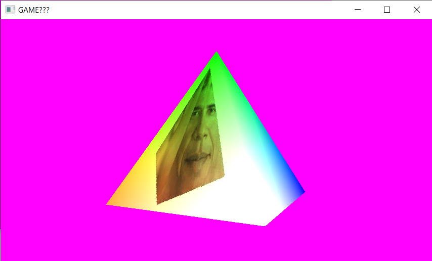

# OpenGL test
Made for testing and learning, some assembly required.

### Features:
- Capturing mouse (lclick) for camera control (esc releases)
- Camera rotation (QE)
- Movement (WASD, space, lshift)

### Internal Features
- Loading OGL
- A nice (incomplete) input system
- Shading geometry
- Loading images

### Building
- When building, build `OPGL`
- If you wish to update library versions, make sure to update the cmake file
- Designed for MinGW (& compilers that aren't MSVC)

Makes use of:
- OpenGL 4.6
- VKFW + GLFW
- GLM
- INCBIN
- stb_image